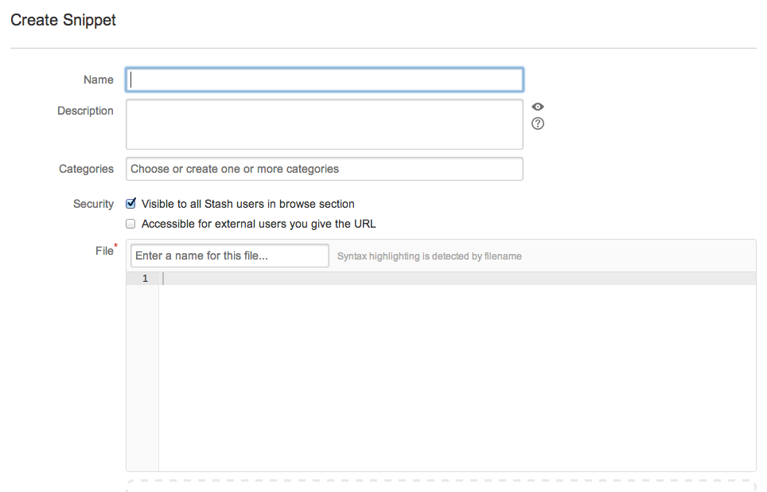

vimsnip
=======

Vim scripts for cURLing source into Stash Snippets directly from Vim using the REST API.

Usage
======
```
:30,55Snippet # create snippet from range
:'<,'>Snippet # create snippet from visual selection (just highlight and call)
:.Snippet # create snippet from just the current line
:%Snippet # create snippet from entire file
  ```
  
Primarily to make my own life easier, since I'm awfully tired of this:




You can paste this at the bottom of your .vimrc file and forget about it. Just replace the username for Stash and it should work fine :) I'll eventually turn this into a plugin.
